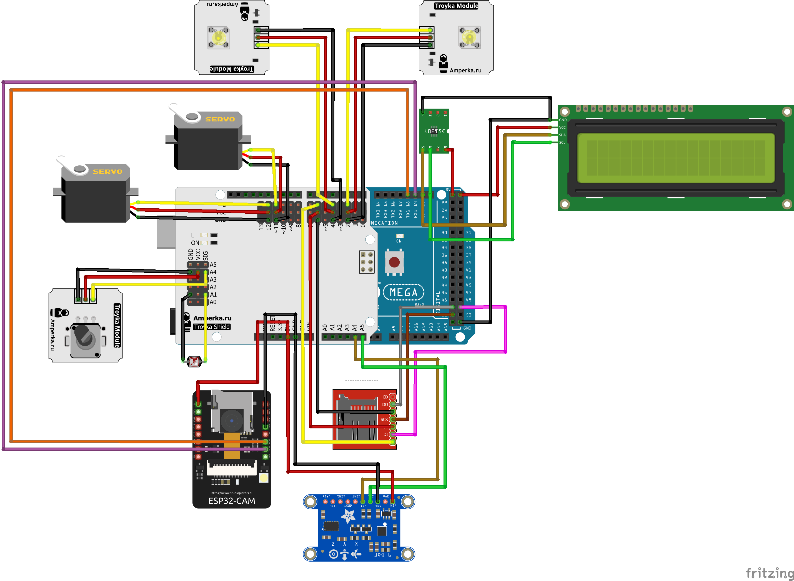
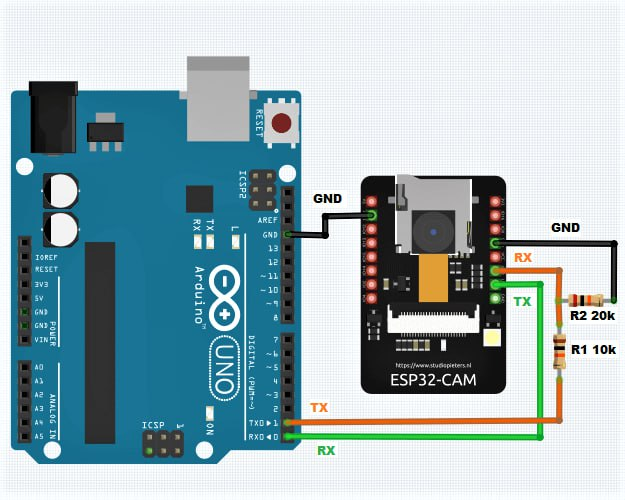
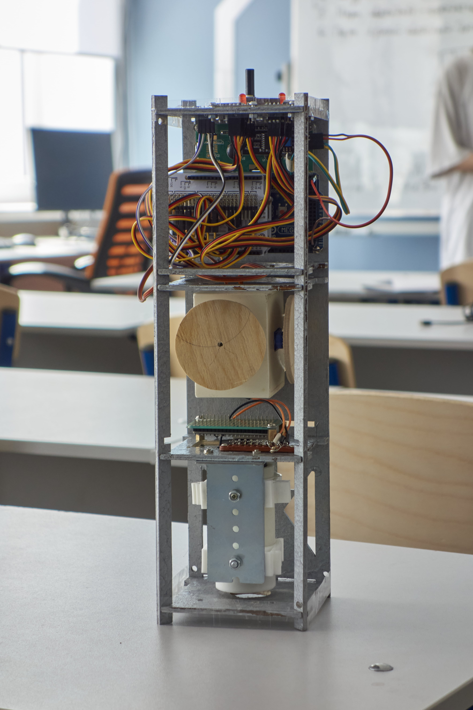
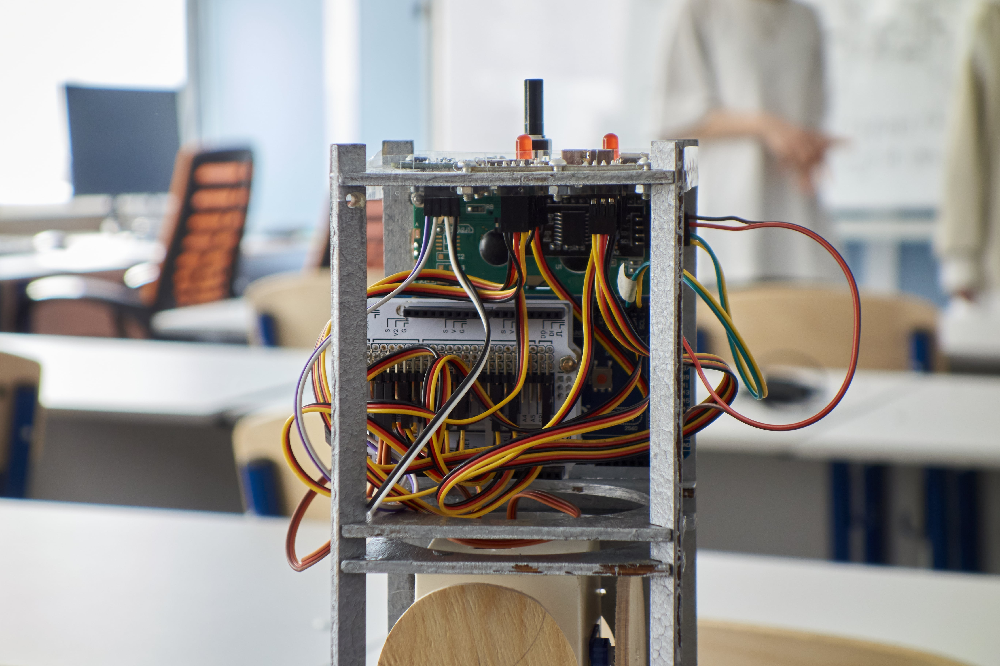
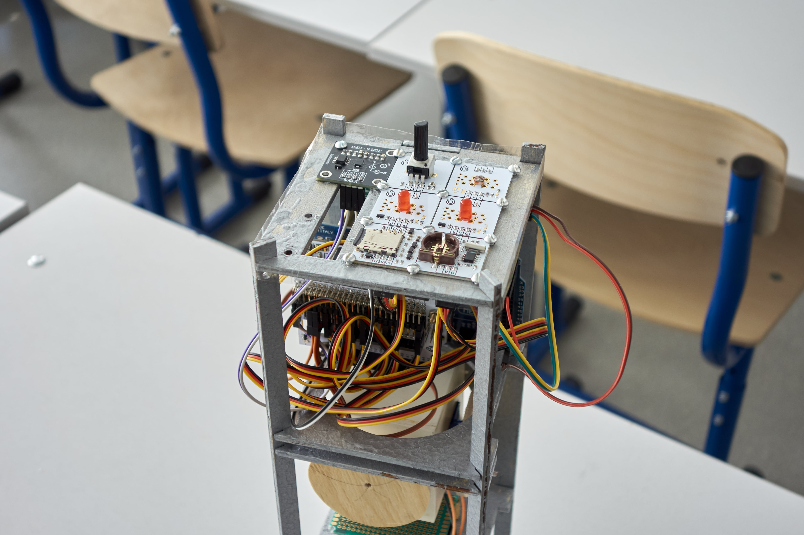

# Макет спутника формата CubeSat 3U

Макет спутника собирался в рамках программы "Сириус.Лето: начни свой проект".

**Цель проекта**: получение школьниками знаний и умений по разработке и сборке макета искусственного спутника Земли Кубсат 3U и программированию
микроконтроллеров. _А вот была ли эта цель достигнута... ну тут сами всё понимаете._

## Используемые компоненты

В таблице представлены только электронные компоненты, так как для них была составлена смета. Корпус спутника достался бесплатно. Прочая мелочёвка (например, крепёж, провода) не учитывалась.

_Цены представлены в российских рублях на момент покупки (конец марта 2025 года)._

| Название компонента | Количество | Цена | Сумма |
| :--------------------------------- | :-------- | :-- | :--- |
| Arduino Mega 2560 (CH340)         | 1          | 1600 | 1600 |
| ESP32-WROVER-DEV с камерой OV2640 | 1          | 1000 | 1000 |
| [Amperka] Troyka Shield LP                  | 1          | 960  | 960  |
| [Amperka] Power Shield (Li-Ion, 2000 мА·ч)  | 1          | 1590 | 1590 |
| [Amperka] Часы реального времени (Troyka-модуль) | 1 | 660 | 660 |
| [Amperka] SD картридер (Troyka-модуль) | 1 | 660 | 660 |
| Cервопривод постоянного вращения Feetech FS90R / 360° | 2 | 810 | 1620 |
| [Amperka] Потенциометр (Troyka-модуль) | 1 | 360 | 360 |
| [Amperka] Датчик освещённости (Troyka-модуль) | 1 | 180 | 180 |
| [Amperka] Светодиод 5 мм (Troyka-модуль) | 2 | 240 | 480 |
| [iArduino] IMU-сенсор на 9 степеней свободы (Trema-модуль) | 1 | 1310 | 1310 |
| ЖК-дисплей 1602 I2C | 1 | 300 | 300 |
| Телескоп | 1 | 600 | 600 |
| | | | **11320** |

## Схема подключения

_Просто кровь течёт из глаз при виде своего творчества %) Но эта схема максимально приближена к реальности._

| Пин | Компонент | Примечание|
| :-- | :-------- | :-------- |
| 20-21 | ЖК-дисплей | 20 — SDA, 21 — SCL |
| 18-19 | ESP32 | 18 — TX1*, 19 — RX1 |
| 12 | Сервопривод |
| 11 | Сервопривод |
| 6 | CS для SD картридера |
| 4 | Светодиод |
| 2 | Светодиод |
| A0 | Заряд аккумулятора | Берётся с Power Shield
| A1 | Датчик освещённости |
| A4 | Потенциометр |
| I2C-1** | Часы реального времени (RTC) |
| I2C-2** | IMU-сенсор |
| SPI-1** | SD картридер |

Для питания RTC и IMU-сенсора были заняты пины 9 и 7 соответственно на Troyka Shield LP.

\*Так как ESP32 работает на 3.3В, то подключение TX (Arduino) => RX (ESP32) было реализовано через делитель напряжения. Схема представлена ниже.

\**Через I2C-x и SPI-x обозначаются разъёмы для соответствующих интерфейсов, разведённые на Troyka Shield LP.

## Возникшие проблемы
- Библиотека `iarduino_Position_BMX055` для работы с IMU-сенсором занимает очень много места в памяти Arduino (около 18 КБ). Вместе с этой библиотекой я не смог загрузить свой небольшой скетч на Uno R3. Поэтому пришлось решать проблему максимально гениально — вместо Uno R3 взять Mega 2560. Можно было поковырять библиотеку, но у меня для этого не было времени.

- Огромное количество проводов от датчиков. Из-за чего подключать шлейфы в низкопрофильный _Troyka Shield LP_ совершенно неудобно. Лучше взять обычный _Troyka Shield_, так как низкопрофильное исполнение в этом проекте не требуется.

- Провода-перемычки (джамперы) для подключения компонентов без пайки плохо держатся в пинах Arduino и часто отваливаются.

- SD-карта Netac на 16 ГБ, купленная специально для этого проекта, отказалась определяться здешним картридером, хотя компьютер читал эту карту нормально. Зато карточки SanDisk на 16 ГБ и Kingston на 32 ГБ сомнительной подлинности завелись сразу же. Все три карты были в файловой системе FAT32. Чем можно объяснить такое поведение, не знаю.

## Фотографии спутника на предзащите

### Вид спереди

### Крупный план

